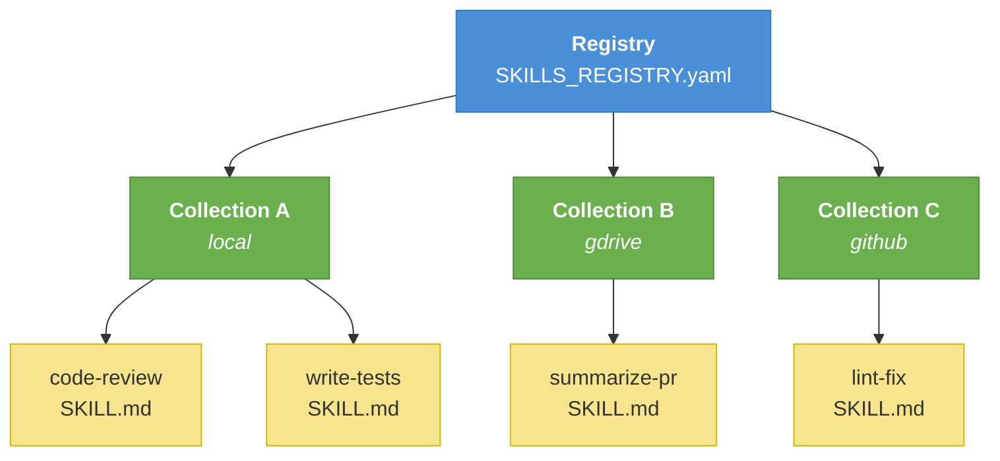
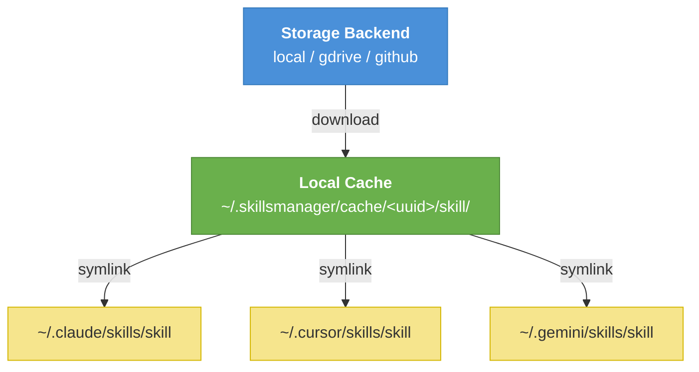

[](https://www.npmjs.com/package/@skillsmanager/cli)
[](LICENSE)
[](https://nodejs.org)
[](https://github.com/talktoajayprakash/skillsmanager/actions)
[](https://talktoajayprakash.github.io/skillsmanager)

# Skills Manager CLI

**A CLI for AI agents to organize, access, and share skills — from any device, with any agent.**

Skills Manager gives your AI agents a single, unified way to find and use every skill — whether it's one you've built yourself or one published in a git repository. Build your own registry, back it with Google Drive, GitHub, or local storage, and every skill becomes instantly searchable and installable across all your agents and devices. When you improve a skill, a single command pushes your changes back to the backend — no manual syncing, no copy-pasting between machines.

No more scattered files. No more per-agent setup. One CLI to manage your skills, one index to search them, and one cache to keep them in sync — wherever you work. Skills Manager even ships with its own skill, so your agent already knows how to use it — just ask.

## Why Skills Manager?

- **Unified skill library** — one searchable index across all your skills, wherever they're stored
- **Cross-agent** — install any skill into Claude, Cursor, Windsurf, Copilot, Gemini, and more
- **Backend-agnostic** — store in Google Drive, GitHub, Dropbox, AWS S3, or local filesystem
- **Sync across devices** — skills follow you, not your machine
- **No duplication** — cached once locally, symlinked into each agent's directory
- **Seamless updates** — edit a skill locally and push changes back to your backend with a single command
- **Agent-native** — ships with a built-in skill that teaches your agent how to use Skills Manager, so you never need to memorize commands


## Supported Agents

`claude` · `codex` · `cursor` · `windsurf` · `copilot` · `gemini` · `roo` · `openclaw` · `agents`


## Quick Start

### 1. Install

```bash
npm install -g @skillsmanager/cli
```

### 2. Install the skillsmanager skill (lets your agent drive Skills Manager)

```bash
skillsmanager install
```

This installs the bundled `skillsmanager` skill into all detected agents so your AI assistant can manage skills on your behalf.

### 3. Connect a remote backend (optional)

Skills Manager supports Google Drive and GitHub as remote backends.

**Google Drive:**

1. Go to [Google Cloud Console](https://console.cloud.google.com/) and create a project
2. Enable the **Google Drive API** for that project
3. Create **OAuth 2.0 credentials** (Desktop app type)
4. Download `credentials.json` and save it to `~/.skillsmanager/credentials.json`

```bash
skillsmanager setup google   # walks you through OAuth
skillsmanager refresh        # discovers collections in your Drive
```

**GitHub:**

```bash
skillsmanager setup github   # checks gh CLI and authenticates
skillsmanager refresh        # discovers collections in your repos
```

## Commands

| Command | Description |
|---|---|
| `skillsmanager status` | Show login status and identity for each backend |
| `skillsmanager install` | Install the skillsmanager skill to all agents |
| `skillsmanager uninstall` | Remove the skillsmanager skill from agent directories |
| `skillsmanager list` | List all available skills |
| `skillsmanager search <query>` | Search skills by name or description |
| `skillsmanager install <name> --agent <agent>` | Download and install a skill for an agent |
| `skillsmanager uninstall <name> --agent <agent>` | Remove a skill's symlink (cache untouched) |
| `skillsmanager add <path>` | Upload a local skill to a collection |
| `skillsmanager add --remote-path <path> --name <n> --description <d>` | Register a remote skill path (no upload) |
| `skillsmanager update <path>` | Push local changes back to remote storage |
| `skillsmanager refresh` | Re-discover collections from remote |
| `skillsmanager skill delete <name>` | Delete a skill from a collection |
| `skillsmanager collection create [name] --backend github --repo <owner/repo>` | Create a collection in a GitHub repo |
| `skillsmanager collection create [name] --skills-repo <owner/repo>` | Create a collection with skills in a separate GitHub repo |
| `skillsmanager registry create` | Create a new local registry |
| `skillsmanager registry list` | Show all registries and their collections |
| `skillsmanager registry discover` | Search a backend for registries owned by the current user |
| `skillsmanager registry add-collection <name>` | Add a collection reference to the registry |
| `skillsmanager registry remove-collection <name>` | Remove a collection reference from the registry |
| `skillsmanager registry push --backend gdrive` | Push local registry to Google Drive |
| `skillsmanager registry push --backend github --repo <owner/repo>` | Push local registry to GitHub |
| `skillsmanager setup google` | One-time Google Drive setup |
| `skillsmanager setup github` | One-time GitHub setup (checks gh CLI and authenticates) |
| `skillsmanager logout google` | Clear Google OAuth session |
| `skillsmanager logout github` | Log out of GitHub |

## Local Development

```bash
git clone https://github.com/talktoajayprakash/skillsmanager.git
cd skillsmanager
npm install
npm run build       # compiles TypeScript to dist/
npm link            # makes `skillsmanager` available globally from source
```

Run tests:

```bash
npm test
```

To run without installing globally:

```bash
node dist/index.js <command>
```

## How it works

Skills Manager organizes skills in a three-layer hierarchy — **registry → collections → skills** — where each layer can live on a different storage backend:



When a skill is installed, it is downloaded once to a local cache and symlinked into each agent's skills directory — one copy on disk, many agents:



## Registry format

Skills are indexed by a `SKILLS_REGISTRY.yaml` file inside any collection folder (local, Google Drive, or GitHub repo):

```yaml
name: my-skills
owner: you@example.com
skills:
  - name: code-review
    path: code-review/
    description: Reviews code for bugs, style, and security issues
```

Each skill is a directory with a `SKILL.md` file:

```markdown
---
name: code-review
description: Reviews code for bugs, style, and security issues
---

... skill instructions ...
```

Skills Manager auto-discovers any `SKILLS_REGISTRY.yaml` across all configured backends on `refresh`.

## Contributing

See [CONTRIBUTING.md](./CONTRIBUTING.md) — PRs welcome.

## Security

See [SECURITY.md](./SECURITY.md) for how to report vulnerabilities.

## License

[Apache 2.0](LICENSE)
