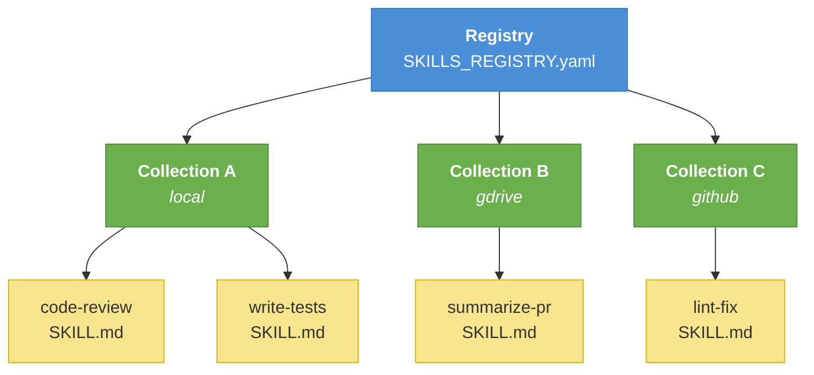
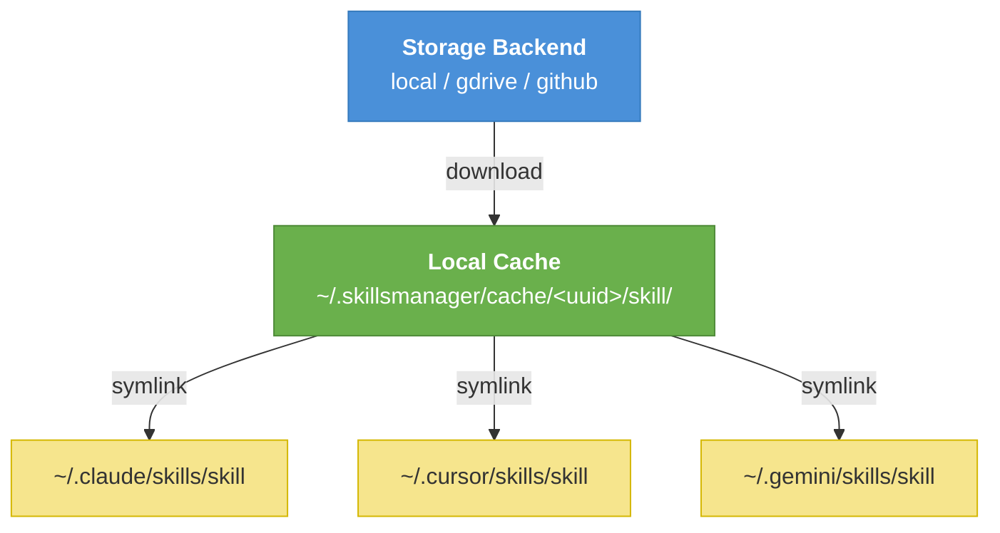

# Skills Manager

**One place to manage, sync, and share all your AI agent skills — across every agent you use.**

[](https://www.npmjs.com/package/@skillsmanager/cli)
[](https://github.com/talktoajayprakash/skillsmanager/blob/main/LICENSE)
[](https://nodejs.org)
[](https://github.com/talktoajayprakash/skillsmanager/actions)

---

You build skills for your AI agents, but keeping track of them is a mess. They're scattered across GitHub repos, local folders, and machines. Each agent has its own directory. Nothing is searchable. Nothing is shared.

**Skills Manager fixes this.** It gives every skill a home — in Google Drive, GitHub, or any storage backend you choose — and makes them instantly available to any agent via a single CLI command. Your agents can search, install, and use any skill regardless of where it lives.

Build skills confidently, store them where you want, and sync them across every device and agent you work with. Skills Manager even ships with its own skill, so your agent already knows how to use it — just ask.

---

## Why Skills Manager?

| | |
|---|---|
| **Unified skill library** | One searchable index across all your skills, wherever they're stored |
| **Cross-agent** | Install any skill into Claude, Cursor, Windsurf, Copilot, Gemini, OpenClaw, and more |
| **Backend-agnostic** | Store in Google Drive, GitHub, Dropbox, AWS S3, or local filesystem |
| **Sync across devices** | Skills follow you, not your machine |
| **No duplication** | Cached once locally, symlinked into each agent's directory |
| **Git-friendly** | Plain Markdown files, easy to version-control and review |
| **Agent-native** | Ships with a built-in skill that teaches your agent how to use Skills Manager — no commands to memorize |

---

## Supported Agents

`claude` · `codex` · `cursor` · `windsurf` · `copilot` · `gemini` · `roo` · `openclaw` · `agents`

See the [Agents reference](./agents) for install paths and details.

---

## How it works

Skills Manager organizes skills in a three-layer hierarchy — **registry → collections → skills** — where each layer can live on a different storage backend:



When a skill is installed, it is downloaded once to a local cache and symlinked into each agent's skills directory — one copy on disk, many agents:



→ [Full architecture and protocol spec](./protocol)

---

## Quick install

```bash
npm install -g @skillsmanager/cli
skillsmanager install    # install the skillsmanager skill to all detected agents
```

→ [Full getting started guide](./getting-started)
